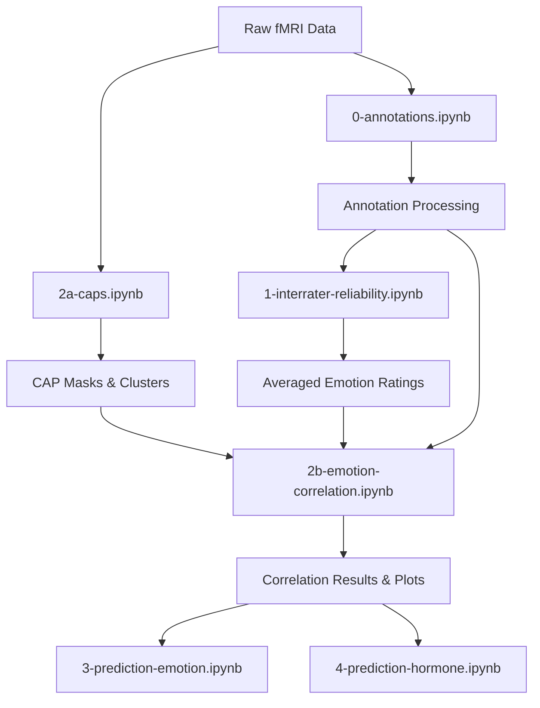

# DIVA Emotion DFC Analysis Pipeline

This repository contains scripts for analyzing emotion-related dynamic functional connectivity (DFC) using Co-Activation Patterns (CAPs) from the DIVA neuroimaging dataset.

## Project Overview

The pipeline processes fMRI data from participants watching "Stranger Things" episodes to identify brain co-activation patterns and their relationships with emotional ratings. The analysis focuses on valence and arousal ratings collected during viewing.

## Script Descriptions

### Data Preparation & Quality Control

#### `0-annotations.ipynb`
**Purpose**: Annotation processing and data quality control
- Processes annotation files (FC, NC, AT types) for episode clips
- Calculates correct episode positions for clips across runs
- Generates `removed_clips_log.csv` with clips to exclude from analysis
- Validates episode structure and clip counts
- **Output**: `dset/derivatives/annotations/removed_clips_log.csv`

### Inter-Rater Reliability

#### `1-interrater-reliability.ipynb`
**Purpose**: Assess reliability of emotion ratings between raters
- Calculates Intraclass Correlation Coefficients (ICC) for valence and arousal
- Computes Spearman correlations between raters
- Generates reliability statistics and plots
- Creates averaged emotion ratings for subsequent analyses
- **Output**: `dset/derivatives/caps/interrater/` (reliability results and averaged ratings)

### CAP Analysis

#### `2a-caps.ipynb` / `2a-caps.py`
**Purpose**: Extract brain timeseries and identify Co-Activation Patterns (CAPs)
- Extracts ROI timeseries using Craddock 270-region atlas
- Performs k-means clustering to identify CAPs (typically 4-5 clusters)
- Generates positive and negative weighted CAP masks
- Creates participant-specific CAP configurations
- **Key Features**:
  - Uses standardized preprocessing pipeline
  - Removes first 5 TRs for T1 equilibration
  - Excludes problematic clips based on annotation analysis
  - Generates z-score weighted masks for each CAP
- **Output**: `dset/derivatives/caps/caps_masks/` (CAP mask files)

#### `2a-run-caps.sh`
**Purpose**: SLURM job script for running CAP analysis on HPC cluster
- Configures computational resources (20 CPUs, 8GB RAM per CPU)
- Sets up conda environment for neuroimaging analysis
- Executes `2a-caps.py` with proper logging

### Emotion Correlation Analysis

#### `2b-emotion-correlation.ipynb` / `2b-emotion-correlation.py`
**Purpose**: Correlate CAP timeseries with emotion ratings
- Extracts weighted CAP timeseries using participant-specific masks
- Correlates CAP activation with valence and arousal ratings
- Generates correlation plots with statistical significance testing
- Supports both episode-level and run-level analysis
- **Key Features**:
  - Multi-participant processing (Blossom: 4 CAPs, Bubbles: 5 CAPs, Buttercup: 4 CAPs)
  - Excludes problematic clips based on episode positions
  - Implements correlation threshold filtering (|ρ| > 0.35)
  - Creates comprehensive visualization plots
- **Output**: 
  - `dset/derivatives/caps/emotion-correlation/` (timeseries and correlation results)
  - `dset/derivatives/figures/` (correlation plots)

#### `2b-run-emotion-correlation.sh`
**Purpose**: SLURM job script for running emotion correlation analysis
- Similar computational configuration to CAP analysis
- Executes `2b-emotion-correlation.py` for all participants

### Prediction Models (In Development)

#### `3-prediction-emotion.ipynb`
**Purpose**: Predict emotion ratings from CAP patterns
- *Currently empty - planned for future development*
- Will implement machine learning models to predict valence/arousal from CAP timeseries

#### `4-prediction-hormone.ipynb`
**Purpose**: Predict hormone levels from brain activity
- *Currently empty - planned for future development*
- Will analyze relationships between CAPs and hormonal measurements

## Analysis Workflow

## Key Output Files

### Intermediate Data
- `dset/derivatives/annotations/removed_clips_log.csv` - Clips excluded from analysis
- `dset/derivatives/caps/interrater/` - Emotion rating reliability and averages
- `dset/derivatives/caps/caps_masks/` - Participant-specific CAP masks

### Final Results
- `dset/derivatives/caps/emotion-correlation/` - CAP-emotion correlation timeseries
- `dset/derivatives/figures/` - Visualization plots
- Statistical correlation reports with significance testing

## Participant Information

The analysis includes three main participants:
- **sub-Blossom**: Episodes 1-2, 4 CAPs identified
- **sub-Bubbles**: Episodes 1-4, 5 CAPs identified  
- **sub-Buttercup**: Episodes 1-4, 4 CAPs identified

Each participant has different episode coverage and optimal CAP numbers determined through silhouette analysis.

## Dependencies

- **Neuroimaging**: nibabel, nilearn, sklearn
- **Statistics**: pandas, numpy, scipy, pingouin
- **Visualization**: matplotlib, seaborn
- **Atlas**: Craddock 270-region parcellation

## Usage Notes

1. **Run Order**: Execute scripts in numerical order (0 → 1 → 2a → 2b)
2. **Environment**: Use conda environment with neuroimaging packages
3. **Cluster**: SLURM scripts configured for HPC execution
4. **Data Exclusion**: Problematic clips are automatically excluded based on annotation analysis
5. **Thresholds**: Correlation plots use |ρ| > 0.35 threshold to focus on meaningful relationships

## File Naming Conventions

- **Episodes**: `S01E01`, `S01E02`, etc.
- **Runs**: `S01E01R01`, `S01E01R02`, etc.
- **CAPs**: `CAP1_pos`, `CAP1_neg`, etc.
- **Outputs**: Include participant, episode, and analysis type in filename